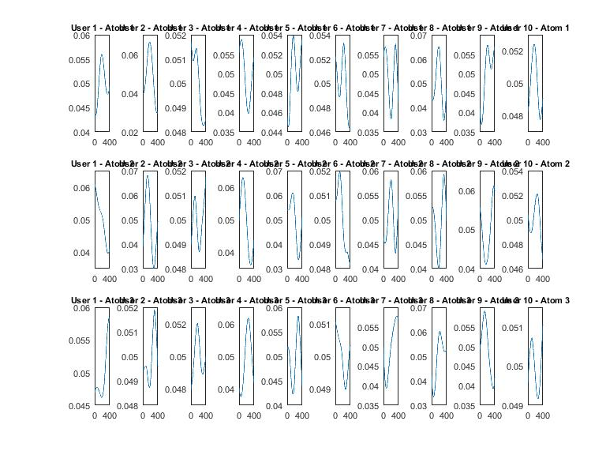
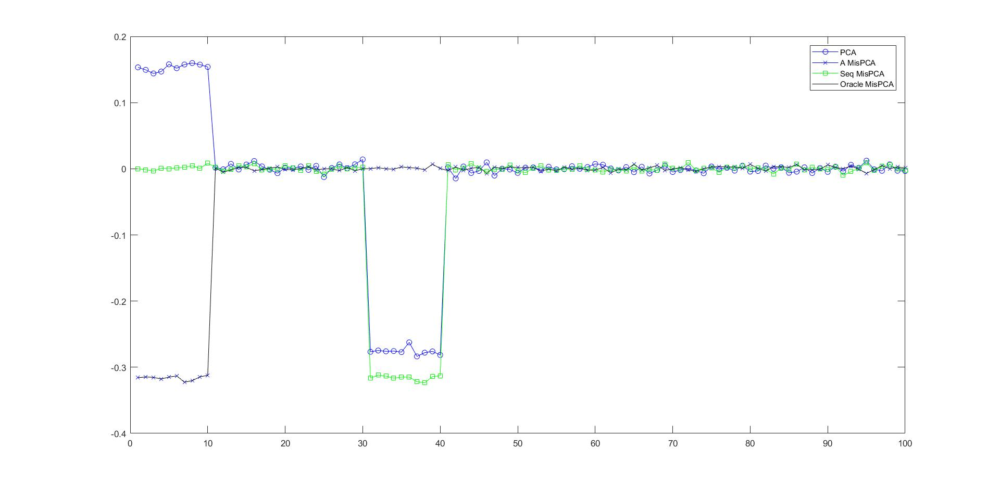
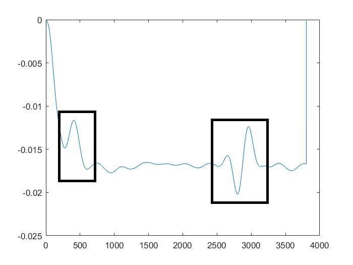
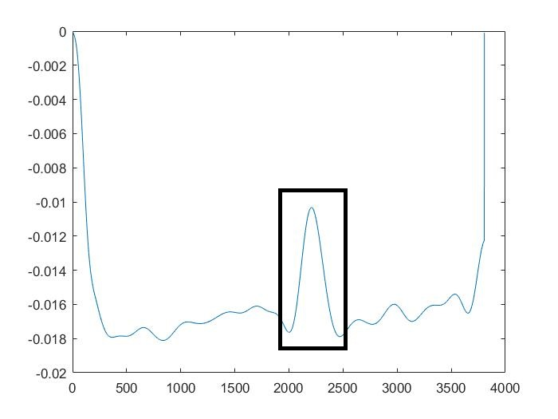
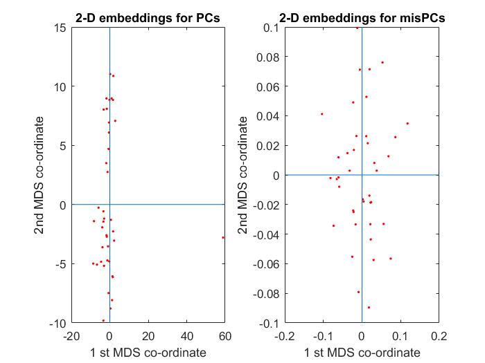

_`# Any queries/questions/concerns can be addressed to: amukher3@rockets.utoledo.edu, abhi0787@gmail.com`_

# Heart-Period-Models
An effort to extract the different response functions for changes in heart period under the effect of suddden continous stimuli rated diversely in the Valence-Arousal scale.  

### Description of the previous ideas: 

Extracting response function for changes in heart period under different kinds of discrete/distinct stimuli(having distinct epochs of stimulus and response) has been previously characterized by Bach et. al. The model used to estimate the response function was basically a linear model initially reduced by dimensionality reduction techniques such as PCA. The extracted reponse function were validated with the physiological response(changes in heart period) of the subjects involved in the study. 
One of the apparent drawbacks of such an approach, apart from the potential limitation of having _`distinct epochs of stimulus-response cycles`_ seemed to be the "baseline" treatment of the _`arythmic component`_. Under various settings of the _`Valence-Arousal`_ scale the _`parasympathetic system`_,although seemingly minimal, has been shown to have a modulating effect on changes in heart period.

We make an effort to characterize the _`response function`_ and the _`arythmic component`_ under a continous stream of stimuli,in an uncontrolled setting, where the subjects involved in the study are watching audio-visual clips which are later rated diversely by the participants in the Valence-Arousal axis. 

### Estimation of the Arythmic component: 

Link to the repo: https://github.com/amukher3/Respiratory-Sinus-Arythmia-estimation
The above repo. has the detailed scripts of the methodology adopted and the different evaluation metrics taken into account. 
Link to the used data-set: https://www.eecs.qmul.ac.uk/mmv/datasets/deap/

### Heart Period Modelling: 
After the described the _`RSA estimation`_ and artifact removal technique our goal was to get reposne function that could explain the changes in the heart period over a period of time for different kinds of continous stimuli. 

There were two different methods that I had started with: 1) Dictionary-learning technique. 
                                                          2) misAligned PCA.  
                                                          
***Dictionary learning technique:*** 
 Used dictionary learning algorithm(K-SVD based) to learn the reposne function. The _`IBI time series`_ was broken into epochs of 5 seconds to form the matrix to be learnt using K-SVD. I decided to choose `5 second` as the window size because the time series being elicited from a continous stream of situmuli would be marred by sudden stimuli thereby the effect of the previous stimuli can be safely assumed to be less than 5 seconds. Another reason to choose a smaller window size was to induce sparsity in the learnt atoms. Having sparse atoms introduces advantages such as easier frequency domain analysis , easily represented de-convolution results etc.  
     One of the fundamental assumptions that I have made is that the _nature of the stimuli is invariant across the different users_, which potentially means that the effect of a partiular clip(or a particular segment) has a similar effect on all the participants. Going forward this might not be a completely prudent assumption but is generally considered a standard practice in the community. It is generally assumed that the response of subjects to standard stimuli functions(especially on the extreme end of the V-A spectrum) lead to very similar responses and strikingly the result seems to support this conjecture as well -- the embeddings(described later) in the 2D plane which seemed to be closer to the ratings(average/median/some central measure) were generally rated extremely in the spectrum. 
     The other way, i.e learning across all the videos for a particular user seemed unreasonable since the different stimuli function presented would manifest in markedly differnt response functions therefore the learnt atoms would not be interpretable. 
     
***Some of the learnt RFs:***

For video_1: 

Some of the atoms learnt throught the dictionary learning technique seemed to have a strong correlation with the physiogically extracted response functions shown by Bach et. al. 
     One of the caveats in this approach was the large number of atoms that were being learnt for the every subject and for every clip which were very diversely rated in the Valence-Arousal(V-A) scale. 
     To circumvent this I decided to find the embedding of the learnt reponse functions. The idea being that the _`2D embeddings`_ of the learnt response functions should have some semblance to the ratings(average/median) of the videos by the participants in the 2D plane of Valence-Arousal. 
     The clips rated extremely in the spectrum did seem to follow the conjecture i.e the 2D embeddings of the learnt response functions and the average ratings of the clips by the participants did seem to be in clusters, but the ratings being very diverse(probable reason being the bias across the participants) some of them could not be agglomerated into clusters surrounding the rating in the V-A scale. 
     I further decided to do some cluster analysis to make sense of the clustering under various measures of central tendency but the some of the result still remains inexplicable. At this point the problem seemed to have turned into a classic unsupervised clustering problem with some in-explicable clusters.Further analysis of the embeddings with different linkage functions or some kind of linkage research might hold the key. 
     A proportion of variance test on the learnt response was also done for the differnt IBI time series(across users and videos) the test seemed to explain a high percentage of variance in the time series for most of the clips. 
     The biggest caveat which still remains with the large number of learnt response functions is the virtually non-existent literature in the psycho-phys communinty when it comes to interpretation of the learnt _`response functions(atoms)`_. After a detailed literature survey I found that the community seemed to have only come up with _interpretation of some of the often seen elicited rsponses which are generally derived under the extreme ends of the V-A spectrum i.e `response functions(RFs) in the extreme ends of the 2D plane of V-A_`. 
     At some point the community needs to realize that one aspect of AI is _'through generative modeling of our deep seated responses,  which are mitigated and modulated by our nervous system's electrical responses_'. The different `RFs` elicited which are placed in the different regions of the `V-A scale` gives us insight into how our sympathetic nervous sytem has reacted to the stimuli. The shape of the `RF(accelaration/decclaration, constant or variable)`, a reflection of the modulation of the heart period, might then lead to some insights as to why we react differently to certain stimulus/conditions. This generative distribution might lead to a better understanding of why certain age groups, gender react differently to different siutations which might refine our understanding of how evolution has affected us differently.
     
***misPCA:***

Earlier work and reference: 

http://web.eecs.umich.edu/~hero/Preprints/puig_asilomar11.pdf

https://github.com/atibaup/MisPCA

***Introduction:***

`misaligned PCA` is a combinatorially exhaustive search technique to estimate the misalignment in a particular principal component. One of the drawbacks of the PC techniques used by Bach et al. was that the estimated principal component did not have any estimate of the latency associated with the response after a stimulus. The latency turns out to be an important parameter when associated with _`Heart Period response`_ functions since it gives us an insight as to how the `V-A spectrum` associates itself with the dynamics of Heart Period changes. A stimuli with a _positive valence_ but _low arousal_ might have a _higher latency_ than a similarly scaled _arousal stimuli_ but with a _negative valence_. Some _PsychoPhys._ literature suggests that latency is a subjective parameter(not completely understood), highly modulated by the effect of Valence rather than Arousal.  This was our primary motivation in moving towards this direction as we had realized that only estimating the response funtion, without any idea of latency could potentially turn out to be a very 'dry' estimate of the effect of Valence. 
Following Bach et al.s methodology we decided to have a window of 30s for extracting the components.Although, as justified earlier a smaller window size might turn out to be a better choice. 

***A result on the simulated-data used by the author in his work:***

This is one of the preliminary result from one of his experimental scripts in the repository. In this the author(s) have shown that the approximation algorithm, `alternating-misPCA(A-misPCA)` reovrers the principal component and the misalignment correctly. 

### Results on the DEAP data-set: 

As described earlier the DEAP data-set had to be pre-processed and then converted to a usable R-R interval time series. Windowing was done as described earlier. 

Some of the estimated components are shown below with a few key points: 

As shown in the above estimated components(~ 30s) there are smaller epochs(~ 5s),shown by the bounding boxes which are strikingly similar to the common responses seen in the PsychoPhys. literature, such reponses were also extracted by Bach et. al. in his experiments. One of the bounding boxes,later in the first time-series shows deceleraton-accelaration which basically means the Heart Rate(HR) falls and then starts climbing. Sudden _impulse like shapes_ are indicative of sudden increase in the HR potentially due to some stimuli. 
Further analysis with the corresponding segment in the clip could give more insight as to how those responses are related to the content in the clips. 

***2D embeddings of the estimated response functions***

The embeddings corresponding to the PC analysis seems to lie close to the vertical axis, mainly spreading into two clusters along one of the dimensions. This is probably indicative of the fact that the learnt response functions has _`captured the variance only in one direction, which is intuitve, since within Valence and Arousal, correct estimation of Valence is always difficult`_. Two distinct clusters(ignoring the ourlier) probably seems to indicate only one scale - High Arousal and low Arousal. This basically means Arousal, is the feature that is predominantly responsible for separating the embeddings into two clusters. 

Estimating Arousal has never been a difficult problem and can be estimated from bunch of Physiological signals without much hassle. The average ***intra-cluster*** and the ***inter-cluster*** distance for the PC analysis also seems to be very high, which supports the fact that the estiamted _'proprtion of Variance'_ explained by the PC analysis was much lower. 

The embeddings of the misaligned PCs seem to spread into the 4 regions, some of the embeddings would match the average rating of the videos in the 2D V-A plane. The average ***inter-intra*** cluster distance also seems to be less compared to the PC analysis which again conforms to the fact that the proportion of variance explained by the method was higher than PC analysis. 

***Note***: Look at the striking similarity between the estimated response functions by the two methods. The RFs within the bounding box for the estimated `misPC` seem to be have similar shapes and could be described similar parametric equation as the ones estimated by `Dictionary Learning` technique. 

***Potential implication(s) and the need for further study***

At the time of writing this article, April'20, study in these areas are mostly restricted to predicting subject's rating of  movies/clips etc. For example, a general framework in these kind of studies, across the world, would generally involve asking the subject(s) completing a questionarire followed by their opinion of the movie/clip(s) etc. This seems to be a more or less general set-up and the goal seems to lie in predicting the participant(s) rating of the video clip from the extracted Phys. signals. A successful estimation of the RFs would certainly aid us in predicting the rating of the participant(s) more accruately and alongside make it more interpretable i.e how the functional form of the RF(basically the parameters) are related to the ratings of the participants. A larger study in this direction, in a diverse population could potentially yield a parametric relation between the ratings and the RFs.

A larger implication of a study in this direction is far more widening and seemingly so impactful that it can potentially change the fate of mankind as we have known it to be.The previous statement might seem to be a bit far-fetched, but pace on as I try to justify myself. 
The mere fact that the heart-rate changes modulate the sympatho-vagal tone is seemingly far more outreaching than we could possibly imagine it to be, one can potentially think of it to be like a 'switch' that can switch between the two systems(Sympath./Para-sympath.).  I am assuming the reader is familiar with the two systems and their effect in generation and control of _`'affect'`_ in humans. If not, a 'short hand' interpretation would be that the Para-sympathetic nervous system makes us calm,restful and possibly 'wiser' whereas the sympathetic nervous system prepares us for the 'flight or fight' , adverse circumstances, the ones we generally associate while having an 'adrenaline rush'.
Controlling the response of the heart period by the estimated functions in such circumstances could  potentially make it independent of the effect of the vagus nerve and perhaps the autonomic nervous system has on it. Now one might argue that such a change might not have the effect that is being presented here or the 'reverting effect' is more vague than plausible, if such thoughts seem to cloud your judgement,preventing you from further exploring this article I would urge you to look into this: https://www.researchgate.net/publication/293944391_Science_of_the_Heart_Volume_2_Exploring_the_Role_of_the_Heart_in_Human_Performance_An_Overview_of_Research_Conducted_by_the_HeartMath_Institute  
To be fair there has been some research,although abductive, that seem to suggest that the Heart has its 'own brain', an intuitive neural network pathway, which in future could technically establish a baseline for 'intelligence' apart from the perceived intelligence, the one we have gathered through evolution. I have used the word 'intuitive' more intentionally than inadvertently here since such 'intelligence' or 'intelligent pathways',although poorly understood, seems to have hardly evolved with time. Without further digression, I would urge the reader to look into the referred article and more such pieces if he/she is interested in knowing more about this area. 
As mentioned earlier,accurately estimated RFs(for the complete V-A plane) could potentially lead to generation and control of _`'affect'`_ thereby aid in modeling of our deep seated responses. As mankind evolves and tries to cope with adverse circumstances in day-to-day lives, having a 'friendly' heart that seems to listen and care could be something that we no longer could afford to ignore since we all could use it to ease off stress and 'un-necessary emotions' from our daily lives.  
As I have previously mentioned that one of the primary goals of AI should lie in generative modeling of our deep seated responses. Studies like these which attempt to find interpretable models takes us a step closer in this direction. I guess at this point it is needless to point out the implication of such work in helping us transit from just AI to a more generalised world of Affective Intelligent Computers(AIE). 

Interesting reads:
[1]:https://mitpress.mit.edu/books/affective-computing
[2]:http://www.macs.hw.ac.uk/~yjc32/project/ref-social%20media%20campaign/1995-affective%20computing.pdf

_`Queries/questions/concerns/comments are more than welcome at amukher3@rockets.utoledo.edu and abhi0787@gmail.com`_

